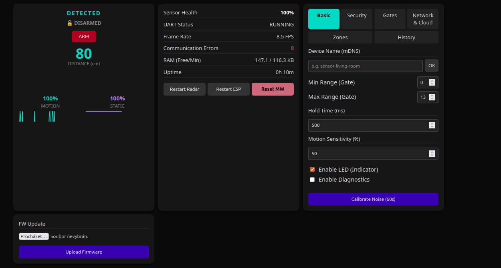
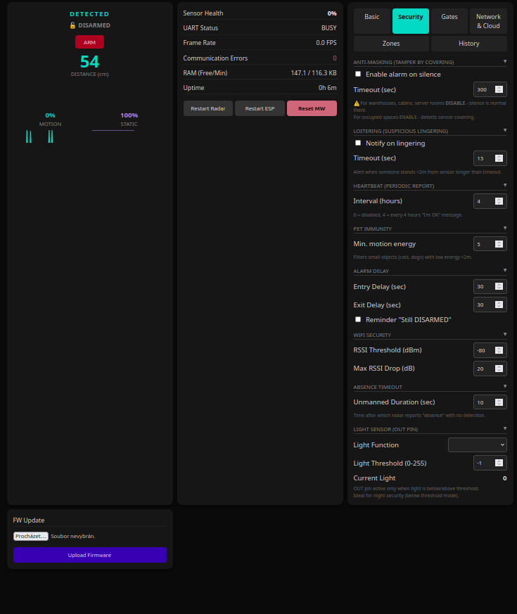
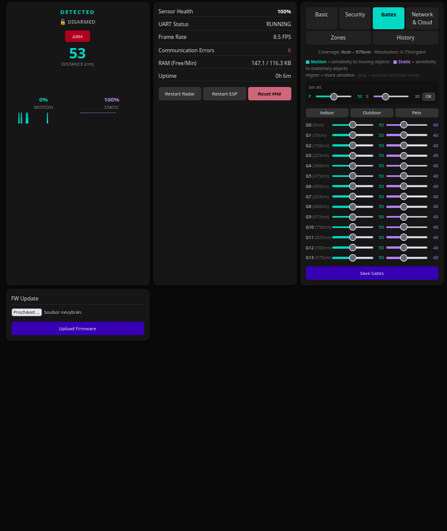
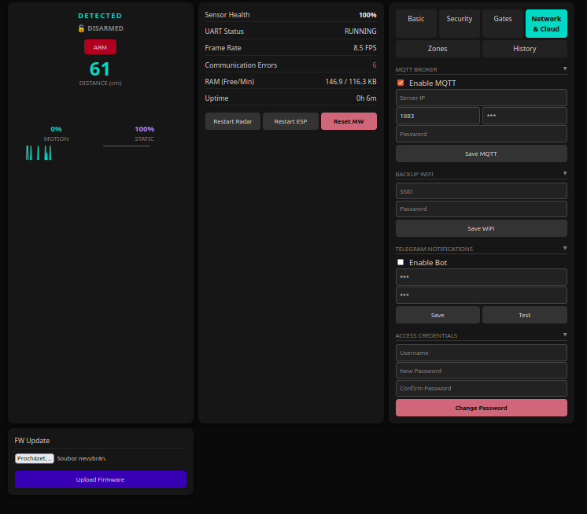
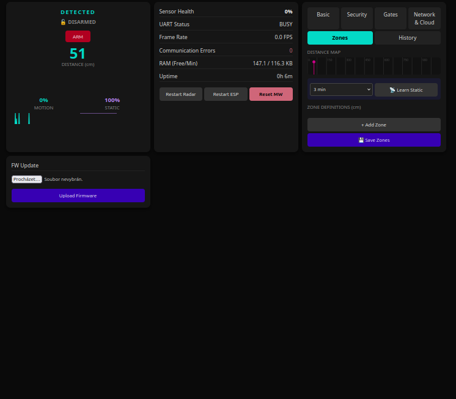
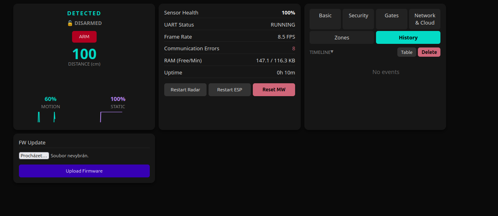

# :shield: LD2412 Security :radar:

[](https://platformio.org/)
[](https://www.espressif.com/)
[](LICENSE)
[]()
[]()

**Standalone intrusion detection system** built on ESP32 + HLK-LD2412 24 GHz mmWave radar. Full alarm state machine, zone management, Home Assistant integration, Telegram bot, and a dark-mode web dashboard. No cloud required.

> [!TIP]
> **New in v3.11** -- Entry/exit path validation, multi-sensor mesh verification, supervision heartbeat, and event timeline UI.

---

## Table of Contents

- [In 3 Points](#in-3-points)
- [Who Is This For](#who-is-this-for)
- [What You Need](#what-you-need)
- [Quick Start](#quick-start) (~10 min)
- [How It Works](#how-it-works)
- [Features](#features)
- [System Architecture](#system-architecture)
- [Web Dashboard](#web-dashboard)
- [Telegram Bot](#telegram-bot)
- [API Reference](#api-reference)
- [Sensor Firmware Quirks](#sensor-firmware-quirks)
- [Known Issues & Limitations](#known-issues--limitations)
- [Troubleshooting](#troubleshooting)
- [Roadmap](#roadmap)
- [FAQ](#faq)
- [Testing](#testing)
- [Real-World Deployment](#real-world-deployment)
- [Development History](#development-history)
- [Acknowledgments](#acknowledgments)
- [License](#license)

---

## In 3 Points

1. **It's a security system, not a smart home gadget.** No light automations, no room tracking. Every feature answers one question: *does this help detect an intruder?*
2. **It works standalone.** WiFi drops at 3 AM? Events are buffered to flash. MQTT broker down? Alarm still triggers locally. No cloud dependency.
3. **It's battle-tested.** 50+ firmware versions, 41 unit tests, 13 security logic bugs found and fixed through formal audit. Running in production since early 2026.

---

## Who Is This For

- **DIY security enthusiasts** who want a self-hosted alarm without cloud subscriptions
- **Home Assistant users** looking for a radar node with proper alarm state management (not just a binary presence sensor)
- **Vacation home / garage / workshop owners** who need affordable, unattended monitoring
- **LD2412 developers** who want a production-tested reference implementation with documented firmware workarounds

---

## What You Need

### Hardware

| Part | Description | ~Cost |
|------|-------------|-------|
| ESP32 DevKit | Any ESP32-WROOM-32 or ESP32-D0WD module | $3--5 |
| HLK-LD2412 | 24 GHz FMCW mmWave radar (UART) | $4--6 |
| 5 V power supply | Stable supply for both ESP32 and radar | $2--3 |
| **Total** | | **~$10** |

Optional: piezo buzzer or relay for siren output (any GPIO).

### Software (All Free)

- [PlatformIO](https://platformio.org/) (VS Code extension or CLI)
- [Home Assistant](https://www.home-assistant.io/) (optional, for MQTT integration)
- [Telegram](https://telegram.org/) (optional, for mobile alerts)

### Required Skills

- Basic soldering (4 wires: VCC, GND, TX, RX)
- Editing a config file (WiFi password, MQTT server)
- Flashing an ESP32 via USB

---

## Quick Start

**~10 minutes from clone to working alarm.**

```bash
# 1. Clone
git clone https://github.com/PeterkoCZ91/HLK-LD2412-security.git
cd HLK-LD2412-security

# 2. Create your config files (BOTH are required — build fails without them)
cp include/secrets.h.example include/secrets.h
cp include/known_devices.h.example include/known_devices.h

# 3. Edit secrets.h — at minimum set your WiFi SSID and password
#    (MQTT and Telegram are optional — leave defaults to skip)

# 4. Wire the sensor (see wiring table below) and connect ESP32 via USB

# 5. Build and flash
pio run -e esp32_type_B --target upload
```

### First Boot

After flashing, the device goes through a WiFi connection sequence:

1. Tries the WiFi credentials from `secrets.h` (5 seconds)
2. Tries previously saved credentials (10 seconds)
3. Tries backup WiFi from NVS if configured (15 seconds)
4. **If all fail** -- creates a WiFi Access Point for configuration:
   - **AP name:** `LD2412_Setup_<MAC>` (e.g. `LD2412_Setup_a1b2c3d4`)
   - **AP password:** `ld2412setup`
   - Connect to this AP, a configuration portal opens automatically
   - Enter your WiFi credentials, click Save, device reboots and connects

Once connected, open the **web dashboard**:
- URL: `http://<device-ip>/` or `http://<hostname>.local/`
- **Default login:** `admin` / `admin` (change it in Network & Cloud tab!)

> [!NOTE]
> **Don't know your ESP32's MAC address?** Flash the firmware, open the serial monitor (`pio device monitor`), and look for `[SYSTEM] MAC: aa:bb:cc:dd:ee:ff`. Use this to fill in `known_devices.h` for auto-identification. For a single device, the example file works as-is.

### Choosing Pin Layout

Type A and Type B are just **two tested pin configurations** -- you can use any ESP32 board with any GPIO pins. The `esp32_custom` environment in `platformio.ini` lets you define your own.

| Environment | UART Pins | Best for | Notes |
|-------------|-----------|----------|-------|
| `esp32_type_A` | RX=16, TX=17 | Boards where GPIO 16/17 are free | Don't use on WROVER/PSRAM boards (GPIO 16/17 conflict) |
| `esp32_type_B` | RX=18, TX=19 | Most boards, safest default | Our production-tested configuration |
| `esp32_custom` | Any | Your own wiring | Edit `platformio.ini` to set your pins |

> **Not sure?** Start with `esp32_type_B` -- it works on the widest range of boards. If the radar doesn't respond (`[RADAR] Failed to init LD2412` in serial monitor), check your wiring matches the pin numbers in your build environment.

### Wiring

**Type A** (ESP32 DevKit v1, free GPIO 16/17):

| ESP32 | LD2412 | Signal |
|-------|--------|--------|
| GPIO 16 | TX | UART RX |
| GPIO 17 | RX | UART TX |
| 5V | VCC | Power |
| GND | GND | Ground |

**Type B** (WROVER, PSRAM boards, or GPIO 16/17 unavailable):

| ESP32 | LD2412 | Signal |
|-------|--------|--------|
| GPIO 18 | TX | UART RX |
| GPIO 19 | RX | UART TX |
| GPIO 21 | OUT | Digital output (optional) |
| 5V | VCC | Power |
| GND | GND | Ground |

> Custom pin configurations are supported -- see `esp32_custom` environment in `platformio.ini`.

---

## How It Works

The LD2412 radar continuously scans a 60-degree cone at 24 GHz, reporting distance (0--9 m), motion energy, and static energy for each of its 14 detection gates (0.75 m per gate). The ESP32 reads these frames over UART, runs them through a security-focused processing pipeline, and makes alarm decisions.

```
  LD2412 Radar          ESP32 Processing Pipeline           Outputs
 +-----------+     +-------------------------------+    +-----------+
 |  24 GHz   | UART|  Frame Parser (state machine) |    |  MQTT/HA  |
 |  FMCW     |---->|  Pet Immunity Filter          |    |  Telegram |
 |  Scanner   |    |  Zone Classifier              |--->|  Webhook  |
 |  14 gates  |    |  Alarm State Machine          |    |  Siren    |
 |  ~5 Hz     |    |  Approach Tracker             |    |  Web UI   |
 +-----------+     +-------------------------------+    +-----------+
```

### Alarm State Machine

```
                    arm (with delay)
  DISARMED ──────────────────────> ARMING
      ^                              |
      |  disarm                      | exit delay expires
      |                              v
      +<─────── TRIGGERED <──── ARMED
                    ^               |
                    |               | detection in zone
                    | entry delay   v
                    +────────── PENDING
```

States: **DISARMED** -> **ARMING** (exit delay) -> **ARMED** -> **PENDING** (entry delay) -> **TRIGGERED** -> auto-rearm or disarm.

---

## Features

### :lock: Security
| Feature | Description |
|---------|-------------|
| Alarm state machine | 5 states with configurable transitions |
| Detection zones | Up to 16 zones with min/max range, per-zone behavior (entry delay / immediate / ignore) |
| Entry & exit delays | Default 30 s each, configurable per-zone |
| Approach tracker | Circular buffer of last 16 armed detections for forensic review |
| Auto-rearm | Re-arms after trigger timeout (default 15 min) |
| Anti-masking | Detects prolonged zero-energy (sensor obstruction or tampering) |
| Pet immunity | Configurable energy threshold filter |
| Loitering detection | Alert when target lingers in close zone beyond timeout |
| Siren/strobe output | Optional GPIO for audible/visual alarm |
| Alarm energy threshold | Minimum energy + debounce before alarm transition |

### :satellite: Connectivity
| Feature | Description |
|---------|-------------|
| MQTT + Home Assistant | Auto-discovery, all entities created automatically |
| MQTT offline buffer | Queues messages to LittleFS when broker unreachable |
| MQTTS (TLS) | Optional encrypted MQTT |
| Telegram bot | 12 commands: arm, disarm, status, learn, mute, restart... |
| Discord / webhook | Generic HTTP POST notifications |
| WiFi failover | Exponential backoff to secondary SSID |
| Scheduled arm/disarm | Cron-like scheduling with timezone support |

### :bar_chart: Diagnostics
| Feature | Description |
|---------|-------------|
| UART health monitoring | Frame rate, error count, resync stats |
| Radar health score | 0--100 composite score |
| RSSI anomaly detection | Baseline tracking, jamming alerts |
| Dead Man's Switch | Auto-restart if no MQTT publish in 30 min |
| Event log | 100 events on LittleFS with CSV export |
| Heap monitoring | Free/min/max-alloc with low-memory warnings |

### :computer: Interface
| Feature | Description |
|---------|-------------|
| Web dashboard | Responsive dark-mode UI with real-time SSE |
| REST API | `/api/health`, `/api/telemetry`, `/api/config` |
| Engineering mode | Per-gate energy visualization via MQTT |
| mDNS | `http://hostname.local/` access |

### :shield: Reliability
| Feature | Description |
|---------|-------------|
| OTA updates | With automatic rollback (60 s validation) |
| Watchdog | 60 s hardware WDT |
| NVS persistence | All config, uptime, alarm state survives reboot |
| Gate config verification | Post-boot check to catch firmware config reverts |

---

## Web Dashboard

Dark-mode responsive web UI accessible at `http://<device-ip>/`. All tabs shown below:

### Status

Real-time detection state, distance, energy bars, radar health score, UART status, and system controls.



### Security

Anti-masking, loitering, pet immunity, entry/exit delays, RSSI monitoring, light sensor configuration.



### Gates

Per-gate motion and static sensitivity with slider controls. One-click presets for indoor, outdoor, and pet-friendly environments.



### Network & Cloud

MQTT broker, backup WiFi, Telegram bot, and access credentials.



### Zones

Visual distance map with zone editor. Configurable alarm behavior per zone (entry delay, immediate, ignore). Entry path validation for intrusion path detection.



### History (Timeline)

Event timeline with color-coded markers by type. Toggle between timeline and table view. CSV export available.



> The entire UI is embedded as a single PROGMEM string (~50 KB). No external files, no SD card, no SPIFFS for the UI.

---

## Telegram Bot

Create a bot via [@BotFather](https://t.me/BotFather), add token and chat ID to `secrets.h`.

| Command | Description |
|---------|-------------|
| `/start` | Welcome + quick command list |
| `/arm` | Arm with exit delay |
| `/arm_now` | Arm immediately |
| `/disarm` | Disarm |
| `/status` | State, distance, energy, uptime, heap |
| `/light` | Ambient light reading (eng mode required) |
| `/learn` | Start static reflector learning (3 min) |
| `/eng_on` `/eng_off` | Toggle engineering mode |
| `/mute` `/unmute` | Notification control |
| `/restart` | Restart ESP32 |

---

## API Reference

### Endpoints

| Endpoint | Method | Description |
|----------|--------|-------------|
| `/api/health` | GET | Uptime, WiFi, MQTT, heap, hostname, reset history, NTP status |
| `/api/telemetry` | GET | Radar state, distance, energy, direction, UART stats |
| `/api/config` | GET/POST | Full configuration read/write |
| `/api/preset?name=indoor` | POST | Apply sensitivity preset |
| `/api/zones` | GET/POST | Zone configuration |
| `/api/events` | GET | Event log (JSON) |
| `/api/events/csv` | GET | Event log export (CSV) |
| `/api/arm` | POST | Arm the system |
| `/api/disarm` | POST | Disarm the system |

### MQTT Topics

Prefix: `security/<device_id>/`

| Topic | Direction | Description |
|-------|-----------|-------------|
| `presence/state` | publish | IDLE / DETECTED / HOLDING / TAMPER |
| `presence/distance` | publish | Distance in cm |
| `presence/energy_mov` | publish | Moving energy (0--100) |
| `presence/energy_stat` | publish | Static energy (0--100) |
| `presence/direction` | publish | approaching / receding / static |
| `alarm/state` | publish | DISARMED / ARMING / ARMED / PENDING / TRIGGERED |
| `alarm/set` | subscribe | `arm` / `disarm` / `arm_now` |
| `alarm/event` | publish | JSON alarm trigger event |
| `alert/tamper` | publish | Tamper/anti-masking alert |
| `alert/loitering` | publish | Loitering alert |
| `diag/rssi` | publish | WiFi signal strength |
| `diag/health_score` | publish | Radar health 0--100 |
| `diag/heap_free` | publish | Free heap KB |
| `availability` | publish | online / offline (LWT) |

---

## System Architecture

```
src/
 +-- main.cpp                  Main loop, WiFi, OTA, telemetry publishing
 +-- WebRoutes.cpp             REST API + SSE endpoints
 +-- ConfigManager.cpp         NVS persistence layer
 +-- services/
      +-- LD2412Service.cpp    Radar driver (UART, state machine, recovery)
      +-- SecurityMonitor.cpp  Alarm logic, zones, anti-masking, approach tracker
      +-- MQTTService.cpp      HA auto-discovery, publish/subscribe
      +-- MQTTOfflineBuffer.cpp Flash-backed message queue
      +-- TelegramService.cpp  Bot polling + command handler
      +-- NotificationService.cpp Webhook + Discord dispatcher
      +-- EventLog.cpp         LittleFS ring buffer (100 events)
      +-- LogService.cpp       In-memory system log

lib/
 +-- LD2412_Extended/          Low-level UART protocol driver
      +-- LD2412.cpp           Frame parser, command interface, ACK verification
      +-- LD2412.h             Protocol constants, buffer management

include/
 +-- constants.h               All timing, thresholds, deadbands
 +-- web_interface.h           Embedded HTML/CSS/JS dashboard (~50 KB)
 +-- secrets.h.example         Credential template
 +-- known_devices.h.example   Multi-device MAC mapping template
```

### Data Flow

```
  UART RX (5 Hz)
       |
  [LD2412.cpp] Frame parser with state machine + length validation
       |
  [LD2412Service.cpp] State tracking, direction inference, health monitoring
       |
  [SecurityMonitor.cpp] Zone classification -> alarm state machine -> event queue
       |
  [main.cpp] Dispatches to:
       +-- MQTTService (HA auto-discovery, deadband publish)
       +-- TelegramService (bot commands)
       +-- NotificationService (webhooks)
       +-- EventLog (LittleFS persistence)
       +-- WebRoutes (SSE real-time stream)
```

---

## Sensor Firmware Quirks

> [!WARNING]
> The HLK-LD2412 has significant firmware-dependent behavior. **V1.26 is the most common version** shipped on new modules, and it has multiple UART command bugs.

| Feature | V1.24 | V1.26 | V1.36 |
|---------|:-----:|:-----:|:-----:|
| Basic frame output | :white_check_mark: | :white_check_mark: | :white_check_mark: |
| Engineering mode (UART) | :x: ACKs, doesn't switch | :x: ACKs, doesn't switch | :white_check_mark: |
| setBaudRate (UART) | :x: ACKs, doesn't switch | :x: ACKs, doesn't switch | ? |
| setResolution (UART) | :x: Breaks radar | :x: Breaks radar | ? |
| FW query (0xA0) | :x: Returns 0 | :white_check_mark: | :white_check_mark: |
| Gate config persistence | :warning: May revert | :warning: May revert after ~30s | :white_check_mark: |

**Built-in workarounds:**
- Baud rate upgrade skipped on V1.26
- Engineering mode auto-disabled on V1.26
- Gate config verified 40s post-boot (catches silent reverts, see [ESPHome #13366](https://github.com/esphome/issues/issues/13366))
- Resolution changes: use HLKRadarTool Bluetooth app (code: **NUNIXB**)

### How to Update / Downgrade Sensor Firmware

The LD2412 radar module has its own firmware, separate from the ESP32. You can change it using the **HLKRadarTool** Bluetooth app.

> [!WARNING]
> Firmware changes are at your own risk. There is no official rollback mechanism, and some versions break features permanently until re-flashed. Always note your current version before changing (`GET /api/health` → `fw_version` field).

**Steps:**

1. **Install HLKRadarTool** -- [Android](https://play.google.com/store/apps/details?id=com.hlk.hlkradartool) / [iOS](https://apps.apple.com/app/hlkradartool/id6475738581)
2. **Power cycle** the LD2412 module (disconnect and reconnect 5V -- the BLE interface only activates for ~30 seconds after power-on)
3. **Connect** via Bluetooth in HLKRadarTool (device shows as `HLK-LD2412_XXXX`)
4. **Enter firmware code:** `NUNIXB` -- this unlocks the firmware download list
5. **Select firmware version:**
   - **V1.26** -- most stable for basic detection (recommended default)
   - **V1.24** -- older, fewer features, FW query broken
   - **V1.36** -- only version with working engineering mode over UART, but **not always available** in the firmware list
6. **Flash** -- takes ~30 seconds, do not power off during update
7. **Power cycle** the module again after flashing
8. **Verify** via ESP32: `GET /api/health` → check `fw_version` field, or serial console at boot

**What the firmware code unlocks:**
- `NUNIXB` -- standard code, gives access to V1.24 and V1.26 (V1.36 may or may not appear)
- Other codes may exist for newer firmware but are not publicly documented

**The HLKRadarTool app is also used for:**
- Changing distance resolution (0.25m / 0.5m / 0.75m) -- **do NOT use UART for this on V1.26**
- Changing baud rate
- Toggling engineering mode (on firmware where UART toggle is broken)
- Real-time gate energy visualization

---

## Known Issues & Limitations

<details>
<summary><strong>Hardware / Firmware (won't fix)</strong></summary>

- Engineering mode over UART broken on V1.24 and V1.26 -- use HLKRadarTool Bluetooth app
- `setResolution()` can brick radar detection on some FW -- only change via Bluetooth
- Radar may not start when powered simultaneously with ESP32 -- HW workaround: short 3 solder joints on LD2412 PCB
- V1.36 (only FW with working eng mode) not available via standard update channel

</details>

<details>
<summary><strong>Software limitations</strong></summary>

- `resync_count` in diagnostics looks alarming but ~20 resyncs/frame is **normal** parser behavior
- MQTT offline buffer limited to ~20 messages (min_spiffs partition constraint)
- Web UI is a 50 KB PROGMEM string -- editing requires firmware rebuild
- Scheduled arm/disarm requires NTP sync (no internet = no schedule)
- No multi-sensor coordination yet (each node is independent)

</details>

<details>
<summary><strong>Compared to ESPHome LD2412</strong></summary>

| Aspect | This project | ESPHome LD2412 |
|--------|-------------|----------------|
| Parser | State machine + length validation | Footer scanning (higher false-positive risk) |
| Command ACKs | Verified | Fire-and-forget |
| UART health | Connection state machine, frame rate, auto-recovery | Basic |
| Eng mode loss | Detected (5 short frames) + recovery | Not detected |
| Config revert bug | Workaround (post-boot verify) | Open issue [#13366](https://github.com/esphome/issues/issues/13366) |
| Alarm system | Full state machine, zones, delays | Binary sensor only |

</details>

---

## Roadmap

| Feature | Status | Description |
|---------|--------|-------------|
| Camera trigger | :bulb: Planned | Snapshot IP camera on alarm event via MQTT/HTTP |
| i18n (CZ/EN toggle) | :bulb: Planned | Runtime language switching in web dashboard |
| Multi-sensor mesh | :white_check_mark: Done | Cross-node alarm verification via MQTT (v3.11.0) |
| Supervision heartbeat | :white_check_mark: Done | Peer monitoring with tamper alert on silence (v3.11.0) |
| Entry/exit path logic | :white_check_mark: Done | Zone path validation — wrong entry path = immediate trigger (v3.11.0) |
| Event timeline UI | :white_check_mark: Done | Visual timeline with color-coded markers (v3.11.0) |
| PoE variant | :white_check_mark: Exists | Ethernet fork using ESP32 + LAN8720A ([POE-2412-security](https://github.com/PeterkoCZ91/POE-2412-security)) |
| FW V1.26 workarounds | :white_check_mark: Done | Gate verify, baud skip, eng mode skip |
| Scheduled arm/disarm | :white_check_mark: Done | Cron-like with timezone (v3.10.0) |
| MQTT offline buffer | :white_check_mark: Done | LittleFS message queue (v3.9.6) |
| Security audit | :white_check_mark: Done | 13 bugs fixed, 41 tests added (v2.6--v3.9) |

---

## Troubleshooting

<details>
<summary><strong>No radar detection after flashing</strong></summary>

**Symptoms:** Web dashboard shows distance 0, energy 0. Serial monitor shows `[RADAR] Failed to init LD2412`.

**Causes & fixes:**
1. **Wrong board type** -- try the other environment (`esp32_type_A` vs `esp32_type_B`)
2. **Wiring error** -- RX/TX are crossed: ESP32 RX connects to LD2412 TX and vice versa
3. **Power issue** -- LD2412 needs stable 5V; some USB ports can't supply enough current for both ESP32 and radar
4. **Radar not starting** -- power cycle the radar module (disconnect 5V briefly). Some modules need a separate power-on sequence

</details>

<details>
<summary><strong>WiFi won't connect / stuck in AP mode</strong></summary>

**What happens on boot:** The device tries 3 WiFi sources in sequence (hardcoded → saved → backup), then falls back to AP portal if all fail.

**Fixes:**
1. Connect to AP `LD2412_Setup_<MAC>` (password: `ld2412setup`) and enter credentials
2. If AP portal doesn't appear, **factory reset**: hold GPIO 0 (BOOT button) for 5+ seconds during startup — clears all saved WiFi and config
3. Check serial monitor for `[WiFi] Trying...` messages to see which stage fails

</details>

<details>
<summary><strong>MQTT not connecting / no Home Assistant entities</strong></summary>

**Check:**
1. MQTT server IP is correct in `secrets.h` or web dashboard (Network & Cloud tab)
2. MQTT broker is running and reachable from device's network
3. MQTT username/password are correct
4. Serial monitor shows `[MQTT] Connected` — if not, check broker logs

**Note:** The device works fully standalone without MQTT. Events are buffered to flash and replayed when MQTT reconnects.

</details>

<details>
<summary><strong>Telegram bot not sending messages</strong></summary>

If the Telegram token in `secrets.h` is empty, the bot is **silently disabled** — no error messages. To verify:
1. Check serial monitor at boot for `[Telegram] Bot initialized` (means it's working) vs no message (disabled)
2. Verify token via `GET /api/health` — if `telegram_enabled` is false, the token is missing or invalid
3. Make sure your bot token is from [@BotFather](https://t.me/BotFather) and the chat ID is correct (use [@userinfobot](https://t.me/userinfobot) to find your chat ID)

</details>

<details>
<summary><strong>False alarms / too sensitive</strong></summary>

1. Apply a sensitivity preset via web dashboard (Gates tab): **Indoor** for rooms, **Outdoor** for open areas, **Pet** for homes with animals
2. Or via API: `POST /api/preset?name=indoor`
3. Increase **pet immunity threshold** (Security tab) to filter low-energy noise
4. Use **static zone learning** (`/learn` via Telegram) to identify furniture reflectors
5. Adjust **zone ranges** to exclude areas outside your space (especially behind walls)

</details>

<details>
<summary><strong>Factory reset</strong></summary>

Hold the **BOOT button** (GPIO 0) for 5+ seconds during device startup. This clears:
- All saved WiFi credentials
- MQTT configuration
- Zone definitions
- Alarm state
- Hostname and device identity

After reset, the device enters AP portal mode for fresh configuration.

</details>

---

## FAQ

<details>
<summary><strong>Do I need Home Assistant?</strong></summary>

No. The system works fully standalone with the web dashboard and Telegram bot. Home Assistant adds remote control via MQTT and nice dashboards, but it's optional.

</details>

<details>
<summary><strong>Can it detect through walls?</strong></summary>

Yes, 24 GHz radar penetrates drywall, wood, and thin partitions. This is both an advantage (mounting flexibility) and a challenge (you may detect people in adjacent rooms). Use zones to limit the detection range.

</details>

<details>
<summary><strong>How do I reduce false alarms?</strong></summary>

1. **Pet immunity threshold** -- filters low-energy detections from small animals
2. **Static zone learning** -- `/learn` command identifies furniture reflectors so they can be filtered
3. **Zone configuration** -- set minimum distance to ignore near-field noise
4. **Alarm energy threshold** -- minimum energy before triggering (default 15)
5. **Sensitivity presets** -- indoor/outdoor/pet presets in the web UI

</details>

<details>
<summary><strong>What happens when WiFi goes down?</strong></summary>

The alarm keeps running locally. Events are logged to flash (EventLog) and MQTT messages are queued in the offline buffer. When connectivity returns, buffered messages are replayed. A Dead Man's Switch restarts the ESP32 if MQTT is down for 30+ minutes.

</details>

<details>
<summary><strong>Can I use multiple sensors?</strong></summary>

Yes, but each node is currently independent. Flash the same firmware to multiple boards -- each identifies itself by MAC address (via `known_devices.h`) and gets its own MQTT topics. Multi-sensor coordination is on the roadmap.

</details>

<details>
<summary><strong>Is engineering mode useful?</strong></summary>

Engineering mode gives per-gate energy readings (14 gates x 2 channels = 28 values at ~4 Hz). It's invaluable for tuning sensitivity and understanding what the sensor sees. However, it only works on FW V1.36+ over UART. On V1.26, use the HLKRadarTool Bluetooth app.

</details>

<details>
<summary><strong>How much does it cost?</strong></summary>

About $10 for a single node (ESP32 + LD2412 + power supply). No subscriptions, no cloud fees, no recurring costs.

</details>

---

## Testing

```bash
# Run all 41 unit tests (no hardware needed)
pio test -e test_native
```

Tests cover:
- UART frame parser (header detection, length validation, resync, edge cases)
- Security monitor logic (state transitions, zone behavior, entry/exit delays, millis overflow)
- Telegram command queue (FIFO, overflow, dequeue)

### Build Environments

The firmware is compiled with pin assignments baked in at build time. Choose the environment that matches your wiring:

| Environment | UART RX | UART TX | OUT Pin | Debug Serial | Use case |
|-------------|---------|---------|---------|:------------:|----------|
| `esp32_type_A` | GPIO 16 | GPIO 17 | -- | -- | DevKit v1, free GPIO 16/17 |
| `esp32_type_B` | GPIO 18 | GPIO 19 | GPIO 21 | :white_check_mark: | WROVER, PSRAM boards, most common |
| `esp32_custom` | GPIO 18 | GPIO 19 | GPIO 5 | :white_check_mark: | Template for custom wiring (edit in `platformio.ini`) |
| `production` | GPIO 18 | GPIO 19 | -- | :white_check_mark: | Generic production build |
| `test_native` | -- | -- | -- | -- | PC-based unit tests, no hardware |

> You can verify which pins a running device was compiled with via the API:
> ```bash
> curl http://<device-ip>/api/health | jq '.build'
> # → { "rx_pin": 18, "tx_pin": 19, "out_pin": 21 }
> ```

### OTA Updates (Multiple Devices)

The same firmware binary works on all your boards. Each device identifies itself by MAC address using the `known_devices.h` lookup table and gets a unique MQTT ID and hostname automatically.

**Workflow for managing multiple devices:**

1. Define your boards in `known_devices.h`:
   ```c
   { "aa:bb:cc:dd:ee:f1", "ld2412_living_room", "sensor-living-room" },
   { "aa:bb:cc:dd:ee:f2", "ld2412_garage",      "sensor-garage" },
   ```

2. Create an OTA environment per device in `platformio.ini`:
   ```ini
   [env:ota_living_room]
   extends = env:esp32_type_B
   upload_protocol = espota
   upload_port = 192.168.1.101
   upload_flags =
       --auth=your_ota_password

   [env:ota_garage]
   extends = env:esp32_custom   ; different pin layout
   upload_protocol = espota
   upload_port = 192.168.1.102
   upload_flags =
       --auth=your_ota_password
   ```

3. Flash all devices:
   ```bash
   pio run -e ota_living_room --target upload
   pio run -e ota_garage --target upload
   ```

> Each device reports its identity at `GET /api/health`:
> ```json
> {
>   "hostname": "sensor-living-room",
>   "chip": { "mac": "AA:BB:CC:DD:EE:F1", "model": "ESP32-D0WDQ6" },
>   "build": { "rx_pin": 18, "tx_pin": 19, "out_pin": 21 }
> }
> ```

---

## Real-World Deployment

Running in production since early 2026 across multiple nodes monitoring residential spaces.

### Hardware Tested

| Board | Chip | Antenna | Notes |
|-------|------|---------|-------|
| ESP32-DevKitC (generic) | ESP32-D0WDQ6 | PCB | Most common, reliable |
| ESP32-D0WD-V3 rev3.1 | ESP32-D0WD-V3 | External u.FL | Best range (RSSI -68 vs -92) |
| FireBeetle ESP32 | ESP32-WROOM-32 | PCB | Works, larger footprint |

### Memory Profile

| Metric | Value |
|--------|-------|
| Free heap at boot | ~166 KB |
| Min heap in operation | ~155 KB |
| Firmware size | ~1.3 MB |
| MQTT min heap for publish | 20 KB |
| EventLog capacity | 100 records |

---

## Development History

Started as a simple presence detector, evolved into a full security system over ~3 months and 50+ versions.

| Phase | Versions | Focus |
|-------|----------|-------|
| Foundation | v1.x | Presence detection, MQTT, basic web UI |
| Security Audit | v2.x | Found and fixed 13 alarm logic bugs, added 28 unit tests |
| Feature Build | v3.0--3.6 | Zones, approach tracking, Telegram, anti-masking, pet immunity |
| Reliability | v3.7--3.9 | MQTT offline buffer, EventLog, Dead Man's Switch, heap optimization |
| Maturity | v3.10+ | Auto-arm, scheduling, timezone, ESPHome community hardening |

See [CHANGELOG.md](CHANGELOG.md) for detailed version history.

---

## Related Projects

- **[multi-sensor-fusion](https://github.com/PeterkoCZ91/multi-sensor-fusion)** -- Python service that fuses this node's MQTT output with other radars (LD2450), WiFi CSI (ESPectre), and Home Assistant sensors into a single weighted-average presence confidence per room. Ships with data-driven weight tuning tools.
- **[HLK-LD2412-POE-security](https://github.com/PeterkoCZ91/HLK-LD2412-POE-security)** -- Ethernet (PoE) variant of this firmware, same alarm logic over wired networking.
- **[HLK-LD2412-POE-WiFi-CSI-security](https://github.com/PeterkoCZ91/HLK-LD2412-POE-WiFi-CSI-security)** -- PoE variant with WiFi CSI passive motion detection added alongside the radar.
- **[HLK-LD2450-security](https://github.com/PeterkoCZ91/HLK-LD2450-security)** -- Sister project using the 2D LD2450 radar (up to 3 targets, zone localization).

---

## Acknowledgments

- [HLK-LD2412 Protocol V1.05](https://assets.super.so/79c0d2a8-d37a-438f-8fbe-c44778f3b0dd/files/6b5abbe3-d359-4ef3-a125-61b32b1620b1/HLK-LD2412_Serial_Communication_Protocol_V1.05_240808.pdf) -- official serial protocol documentation
- [tobiastl/LD2412](https://github.com/tobiastl/LD2412) -- Arduino library (base for our extended driver)
- [Rihan9/LD2412](https://github.com/Rihan9/LD2412) -- ESPHome integration (parser patterns, merged into ESPHome v2025.8.0)
- [jacque99/ld2412](https://github.com/jacque99/ld2412) -- ESP-IDF driver (multi-task architecture reference)
- ESPHome community -- protocol insights, firmware compatibility testing, security audit patterns

---

## License

MIT License. See [LICENSE](LICENSE) for details.

## Contributing

1. Fork the repository
2. Create a feature branch (`git checkout -b feature/my-feature`)
3. Keep commits focused and test your changes (`pio test -e test_native`)
4. Open a pull request with a clear description

Bug reports and feature requests are welcome via [GitHub Issues](../../issues).
